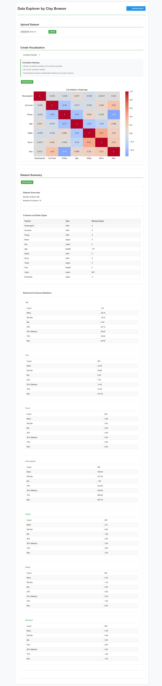

### Repository Name: data-explorer
### Author: Clay Bowser
### Date: December 2nd 2024
### This repository hosts an interactive web application for exploring and visualizing datasets. This tool allows users to upload CSV files, create various types of visualizations, and view statistical summaries of their data.
---
# Data Explorer by Clay Bowser

## Features

- Upload and analyze CSV datasets
- Interactive data visualization with multiple plot types:
  - Scatter plots: Show relationships between two variables
  - Bar charts: Display distributions of categorical data
  - Correlation heatmaps: Visualize relationships between all numerical variables
- Detailed statistical summaries
- Downloadable HTML reports
- Clean and intuitive user interface

## Project Structure
```
data-explorer/
├── app.py                 # Main Flask application
├── templates/
│   └── index.html        # Main HTML template
├── static/
│   ├── css/
│   │   └── style.css     # Application styling
│   └── js/
│       └── main.js       # Frontend JavaScript
├── tests/
│   ├── __init__.py
│   ├── test_app.py       # Unit tests
│   └── test_data/
│       └── sample.csv    # Test dataset
└── requirements.txt      # Python dependencies
```

## Installation

1. Clone the repository or create a new directory:
   ```bash
   git clone https://github.com/claybowser/data-explorer.git
   cd data-explorer
   ```

2. Create and activate a virtual environment (recommended):
   ```bash
   python -m venv venv
   source venv/bin/activate  # On Windows: venv\Scripts\activate
   ```

3. Install required packages:
   ```bash
   pip install -r requirements.txt
   ```

## Running the Application

1. Start the Flask server:
   ```bash
   python app.py
   ```

2. Open a web browser and navigate to `http://localhost:5000`

## Using the Application

1. **Upload Data**
   - Click "Choose File" to select a CSV file
   - Click "Upload" to load the dataset

2. **Create Visualizations**
   - Select a plot type from the dropdown menu
   - Choose columns for analysis based on the plot type:
     - Scatter Plot: Select X and Y axes
     - Bar Chart: Select one column
     - Heatmap: Automatically uses all numerical columns
   - Click "Generate Plot" to create the visualization

3. **View Statistics**
   - Click "Get Summary" to view comprehensive dataset statistics
   - See information about:
     - Dataset dimensions
     - Column types
     - Missing values
     - Statistical summaries

4. **Download Reports**
   - Click "Download Report" to save current analysis as HTML
   - Reports include:
     - Current visualization
     - Data summary
     - Timestamp
     - Plot descriptions

## Running Tests

The application includes a comprehensive test suite. To run the tests:

1. Ensure you're in the project root directory and your virtual environment is activated

2. Run tests using unittest:
   ```bash
   python -m unittest tests/test_app.py
   ```
   
   Or using pytest:
   ```bash
   pytest tests/ -v
   ```

The test suite covers:
- File upload functionality
- Plot generation for all visualization types
- Summary statistics generation
- Error handling
- CSS endpoint functionality

## Technology Stack

- **Backend**: Flask
- **Data Processing**: Pandas, NumPy
- **Visualization**: Matplotlib, Seaborn
- **Frontend**: HTML, CSS, JavaScript
- **Testing**: unittest, pytest

## Requirements

- Python 3.6+
- Flask 2.0.1+
- Pandas 1.3.3+
- NumPy 1.21.2+
- Matplotlib 3.4.3+
- Seaborn 0.11.2+
- Additional dependencies listed in requirements.txt

## Contributing

Feel free to submit issues, fork the repository, and create pull requests for any improvements.

## License

This project is licensed under the MIT License - see the LICENSE file for details.

## Application User Interface

